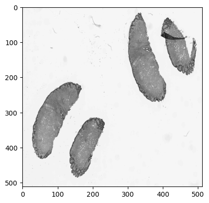
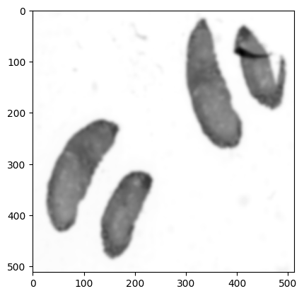
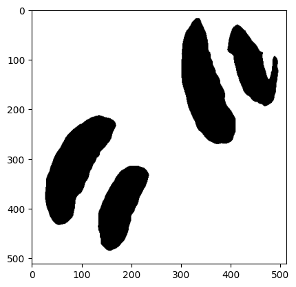
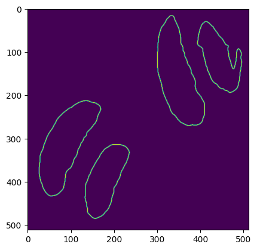

# Image Processing
We use Scikit-Image (skimage), SciPy, PyVIPS, NiBabel, Pydicom, and HighDicom as our primary libraries. You're welcome to use other libraries in conjunction with the tools found here but these libraries were chosen for their balance of performance, portability, and capabilities.

## Imsuite
Imsuite is designed to be a (somewhat) seamless tool for doing image processing in Python when coming from a MATLAB background. Commonly used MATLAB image processing functions are defined using the libraries mentioned above. The outputs are not guaranteed to be identical but they should execute roughly the same ideas as your MATLAB functions. For example imerode uses the skimage.morphology erosion function. It might not erode exactly the same but it will erode a given mask. Imsuite is also designed to avoid "oopsie errors" like out of memory errors.

## Imsuite IO
Imsuite contains a majority of our image processing utilities, most of these are simple wrappers or helpers for the libraries mentioned above. If you're already proficient in python, feel free to simply use the old functions you know and love. These functions are created to emulate prexisting matlab functions.
imread will read just about any image, but it will complain if there is a more specific function. For example if you read a nifti using imread it will read it, but it will complain to you saying: "Nifti detected, use niftiread() for clarity if possible otherwise enable wild. Using niftiread..." As the warning says, you should use niftiread if you know you are going to read a nifti. Imsuite uses pyvips for WSIs as well as standard image formats, uses NiBabel for nifti images, pydicom for dicom files, and highdicom for dicomseg.

## Imsuite Image Processing
Imsuite primarily uses Scikit-Image and SciPy for image processing functions. These libraries are well maintained and popular open source image processing tools. OpenCV is avoided in this as it is not terribly portable due to it's reliance on C code, where skimage and scipy are pure python libraries. PyVIPS is an exception as it depends on the VIPS C library but the developer is a super cool dude and does a great job of maintaining the library. I've never had any issues with VIPS or PyVIPS, which is something I cannot say for OpenCV.

## Example Usage
For this example we will take an image from openslide's public test data.
```python
import requests
image_url = 'https://openslide.cs.cmu.edu/download/openslide-testdata/Generic-TIFF/CMU-1.tiff'
img_data = requests.get(image_url).content
with open('image_name.jpg', 'wb') as handler:
    handler.write(img_data)
```
We're going to get the edges of the image, for no real reason other than it uses a lot of our functions
```python
import numpy as np
import matplotlib.pyplot as plt
from lavlab import imsuite

# Load the image from a file or URL
image = imsuite.imread('image_name.jpg')

# Resize the image to a more manageable size
image = imsuite.imresize(image, (512, 512))

# Convert the image to grayscale
image = imsuite.rgb2gray(image)

# Display the original grayscale image
imsuite.imshow(image)

# Apply a Gaussian filter to the grayscale image for denoising
image = imsuite.imgaussfilt(image, sigma=3)

# Display the denoised image
imsuite.imshow(image)

# Apply Otsu thresholding to the denoised image for segmentation
image = imsuite.imbinarize(image)

# Display the segmented image
imsuite.imshow(image)

# Apply the Sobel filter to the denoised image for edge detection
image = imsuite.edge(image)

# Display the edge-detected image
imsuite.imshow(image)
```

Outputs:




